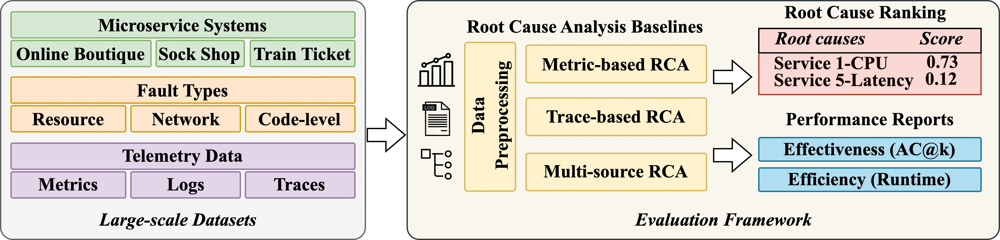

# 🕵️ RCAEval: A Benchmark for Root Cause Analysis of Microservice Systems

[](https://zenodo.org/doi/10.5281/zenodo.13294048)
[](https://pypi.org/project/RCAEval)
[](https://dl.circleci.com/status-badge/redirect/gh/phamquiluan/RCAEval/tree/main)
[](https://github.com/phamquiluan/RCAEval/actions/workflows/build-and-test.yml)
[](https://github.com/phamquiluan/RCAEval/actions/workflows/python-publish.yml)

RCAEval is an open-source benchmark that offers three datasets (RE1, RE2, RE3) and an evaluation framework for root cause analysis (RCA) in microservice systems. It includes 15 reproducible baselines covering metric-based, trace-based, and multi-source RCA methods.

<p align="center">

</p>

**Table of Contents** 
  * [Prerequisites](#prerequisites)
  * [Installation](#installation)
  * [How-to-use](#how-to-use)
    + [Data format](#data-format)
    + [Basic usage example](#basic-usage-example)
  * [Available Datasets](#available-datasets)
  * [Available Baselines](#available-baselines)
  * [Reproducibility](#reproducibility)
    + [RCAEval Benchmark Paper](#rcaeval-benchmark-paper)
    + [For ASE Paper](#for-ase-paper)
  * [Creating New RCA Datasets or Methods](#creating-new-rca-datasets-or-methods)
  * [Licensing](#licensing)
  * [Acknowledgments](#acknowledgments)
  * [Change Logs](#change-logs)
  * [Citation](#citation)
  * [Contact](#contact)

## Prerequisites

We recommend using machines equipped with at least 8 cores, 16GB RAM, and ~50GB available disk space with Ubuntu 22.04 or Ubuntu 20.04, and Python3.10 or above.

## Installation

The `default` environment, which is used for most methods, can be easily installed as follows. Detailed installation instructions for all methods are in [SETUP.md](docs/SETUP.md).


Open your terminal and run the following commands

```bash
sudo apt update -y
sudo apt install -y build-essential \
  libxml2 libxml2-dev zlib1g-dev \
  python3-tk graphviz
```

Clone RCAEval from GitHub

```bash
git clone https://github.com/phamquiluan/RCAEval.git && cd RCAEval
```

Create virtual environment with Python 3.10 (refer [SETUP.md](docs/SETUP.md) to see how to install Python3.10 on Linux)

```bash
python3.10 -m venv env
. env/bin/activate
```

Install RCAEval using pip

```bash
pip install pip==20.0.2
pip install -e .[default]
```

Or, install RCAEval from PyPI

```bash
# Install RCAEval from PyPI
pip install pip==20.0.2
pip install RCAEval[default]
```

Test the installation

```bash
python -m pytest tests/test.py::test_basic
```

Expected output after running the above command (it takes less than 1 minute)

```bash 
$ pytest tests/test.py::test_basic
============================== test session starts ===============================
platform linux -- Python 3.10.12, pytest-7.3.1, pluggy-1.0.0
rootdir: /home/ubuntu/RCAEval
plugins: dvc-2.57.3, hydra-core-1.3.2
collected 1 item                                                                 

tests/test.py .                                                            [100%]

=============================== 1 passed in 3.16s ================================
```

## How-to-use

### Data format

The telemetry data must be presented as `pandas.DataFrame`. We require the data to have a column named `time` that stores the timestep. A sample of valid data could be downloaded using the `download_data()` or `download_multi_source_data()` method that we will demonstrate shortly below.

### Basic usage example

A basic example to use BARO, a metric-based RCA baseline, to perform RCA are presented as follows,

```python
# You can put the code here to a file named test.py
from RCAEval.e2e import baro
from RCAEval.utility import download_data, read_data

# download a sample data to data.csv
download_data()

# read data from data.csv
data = read_data("data.csv")
anomaly_detected_timestamp = 1692569339

# perform root cause analysis
root_causes = baro(data, anomaly_detected_timestamp)["ranks"]

# print the top 5 root causes
print("Top 5 root causes:", root_causes[:5])
```

Expected output after running the above code (it takes around 1 minute)

```
$ python test.py
Downloading data.csv..: 100%|████████████████████| 570k/570k [00:00<00:00, 19.8MiB/s]
Top 5 root causes: ['emailservice_mem', 'recommendationservice_mem', 'cartservice_mem', 'checkoutservice_latency', 'cartservice_latency']
```

A tutorial of using Multi-source BARO to diagnose failure using multi-source telemetry data (metrics, logs, and traces) is presented in [docs/multi-source-rca-demo.ipynb](docs/multi-source-rca-demo.ipynb). 

A tutorial of using BARO to diagnose code-level faults is presented in [docs/code-level-rca.ipynb](docs/code-level-rca.ipynb).


## Available Datasets

RCAEval benchmark includes three datasets: RE1, RE2, and RE3, designed to comprehensively support benchmarking RCA in microservice systems. Together, our three datasets feature 735 failure cases collected from three microservice systems (Online Boutique, Sock Shop, and Train Ticket) and including 11 fault types. Each failure case also includes annotated root cause service and root cause indicator (e.g., specific metric or log indicating the root cause). The statistics of the datasets are presented in the Table below.

|   Dataset   |   Systems  |   Fault Types            |   Cases  |   Metrics  |   Logs (millions)  |   Traces (millions)  |
|-------------|------------|--------------------------|----------|------------|--------------------|----------------------|
|   RE1       |   3        |   3 Resource, 2 Network  |   375    |   49-212   |   N/A              |   N/A                |
|   RE2       |   3        |   4 Resource, 2 Network  |   270    |   77-376   |   8.6-26.9         |   39.6-76.7          |
|   RE3       |   3        |   5 Code-level           |   90     |   68-322   |   1.7-2.7          |   4.5-4.7            |

Our datasets and their description are publicly available in Zenodo repository with the following information:
- Dataset DOI: https://doi.org/10.5281/zenodo.14590730
- Dataset URL: [https://zenodo.org/records/14590730](https://zenodo.org/records/14590730)

We also provide utility functions to download our datasets using Python. The downloaded datasets will be available at directory `data`.

```python
from RCAEval.utility import (
    download_re1_dataset,
    download_re2_dataset,
    download_re3_dataset,
)

download_re1_dataset()
download_re2_dataset()
download_re3_dataset()
```
<details>
<summary>Expected output after running the above code (it takes half an hour to download and extract the datasets. )</summary>

```
$ python test.py
Downloading RE1.zip..: 100%|█████████████████████| 390M/390M [01:02<00:00, 6.22MiB/s]
Downloading RE2.zip..: 100%|███████████████████| 4.21G/4.21G [11:23<00:00, 6.17MiB/s]
Downloading RE3.zip..: 100%|█████████████████████| 534M/534M [01:29<00:00, 5.97MiB/s]
```
</details>


## Available Baselines 

RCAEval stores all the RCA methods in the `e2e` module (implemented in `RCAEval.e2e`). There are 15 RCA baselines available: RUN, CausalRCA, CIRCA, RCD, MicroCause, EasyRCA, MSCRED, BARO, 𝜖-Diagnosis, TraceRCA, MicroRank, PDiagnose, Multi-source BARO, Multi-source RCD, Multi-source CIRCA.

## Reproducibility

### RCAEval Benchmark Paper

We provide a script named `main.py` to assist in reproducing the results from [our RCAEval paper](https://arxiv.org/pdf/2412.17015). This script can be executed using Python with the following syntax: 

```
python main.py [-h] [--dataset DATASET] [--method METHOD]
```

The available options and their descriptions are as follows:

```
options:
  -h, --help            Show this help message and exit
  --dataset DATASET     Choose a dataset. Valid options:
                        [re2-ob, re2-ss, re2-tt, etc.]
  --method METHOD       Choose a method (`causalrca`, `microcause`, `e_diagnosis`, `baro`, `rcd`, `circa`, etc.)
```

For example, in Table 6, BARO achieves Avg@5 of 0.72, 0.99, 1, 0.83, 0.64, and 0.8 for CPU, MEM, DISK, SOCKET, DELAY, LOSS, and AVERAGE on the Train Ticket dataset. To reproduce these results, you can run the following commands:

```bash
python  main.py --method baro --dataset re2-tt
```

The expected output should be exactly as presented in the paper (it takes less than 1 minute to run the code)

```
$ python  main.py --method baro --dataset re2-tt --length 20
100%|███████████████████████████████████████████████████████████████████████████████████████████████████████████████████████████| 90/90 [00:45<00:00,  1.98it/s]
--- Evaluation results ---
Avg@5-CPU:   0.72
Avg@5-MEM:   0.99
Avg@5-DISK:  1.0
Avg@5-SOCKET: 0.83
Avg@5-DELAY: 0.63
Avg@5-LOSS:  0.64
---
Avg speed: 0.51
```

We can replace the baro method with other methods (e.g., circa) and substitute re2-tt with other datasets to replicate the corresponding results shown in Table 6. This reproduction process is also integrated into our Continuous Integration (CI) setup. For more details, refer to the [.circleci/config.yml](.circleci/config.yml) file.


### For ASE Paper
We provide a script named `main-ase.py` to assist in reproducing the results from [our ASE paper](https://dl.acm.org/doi/abs/10.1145/3691620.3695065). This script can be executed using Python with the following syntax: 

```
python main-ase.py [-h] [--dataset DATASET] [--method METHOD] [--tdelta TDELTA] [--length LENGTH] [--test] 
```

The available options and their descriptions are as follows:

```
options:
  -h, --help            Show this help message and exit
  --dataset DATASET     Choose a dataset. Valid options:
                        [online-boutique, sock-shop-1, sock-shop-2, train-ticket,
                         circa10, circa50, rcd10, rcd50, causil10, causil50]
  --method METHOD       Choose a method (`pc_pagerank`, `pc_randomwalk`, `fci_pagerank`, `fci_randomwalk`, `granger_pagerank`, `granger_randomwalk`, `lingam_pagerank`, `lingam_randomwalk`, `ntlr_pagerank`, `ntlr_randomwalk`, `causalrca`, `causalai`, `run`, `microcause`, `e_diagnosis`, `baro`, `rcd`, `nsigma`, and `circa`)
  --tdelta TDELTA       Specify $t_delta$ to simulate delay in anomaly detection (e.g.`--tdelta 60`)
  --length LENGTH       Specify the length of the time series (used for RQ4)
  --test                Perform smoke test on certain methods without fully run
```

For example, in Table 5, BARO [ $t_\Delta = 0$ ] achieves Avg@5 of 0.97, 1, 0.91, 0.98, and 0.67 for CPU, MEM, DISK, DELAY, and LOSS fault types on the Online Boutique dataset. To reproduce these results, you can run the following commands:

```bash
python main-ase.py --dataset online-boutique --method baro 
```

The expected output should be exactly as presented in the paper (it takes less than 1 minute to run the code)

```
--- Evaluation results ---
Avg@5-CPU:   0.97
Avg@5-MEM:   1.0
Avg@5-DISK:  0.91
Avg@5-DELAY: 0.98
Avg@5-LOSS:  0.67
---
Avg speed: 0.07
```

As presented in Table 5, BARO [ $t_\Delta = 60$ ] achieves Avg@5 of 0.94, 0.99, 0.87, 0.99, and 0.6 for CPU, MEM, DISK, DELAY, and LOSS fault types on the Online Boutique dataset. To reproduce these results, you can run the following commands:

```bash
python main-ase.py --dataset online-boutique --method baro --tdelta 60
```

The expected output should be exactly as presented in the paper (it takes less than 1 minute to run the code)

```
--- Evaluation results ---
Avg@5-CPU:   0.94
Avg@5-MEM:   0.99
Avg@5-DISK:  0.87
Avg@5-DELAY: 0.99
Avg@5-LOSS:  0.6
---
Avg speed: 0.07
```

We can replace the baro method with other methods (e.g., nsigma, fci_randomwalk) and substitute online-boutique with other datasets to replicate the corresponding results shown in Table 5. This reproduction process is also integrated into our Continuous Integration (CI) setup. For more details, refer to the [.github/workflows/reproducibility.yml](.github/workflows/reproducibility.yml) file.

## Creating New RCA Datasets or Methods

For detailed guidance, refer to [EXTENDING.md](docs/EXTENDING.md).

## Licensing

This repository includes code from various sources with different licenses. We have included their corresponding LICENSE into the [LICENSES](LICENSES) directory:

- **BARO**: Licensed under the [MIT License](LICENSES/LICENSE-BARO). Original source: [BARO GitHub Repository](https://github.com/phamquiluan/baro/blob/main/LICENSE).
- **CausalRCA**: No License. Original source: [CausalRCA GitHub Repository](https://github.com/AXinx/CausalRCA_code).
- **CIRCA**: Licensed under the [BSD 3-Clause License](LICENSES/LICENSE-CIRCA). Original source: [CIRCA GitHub Repository](https://github.com/NetManAIOps/CIRCA/blob/master/LICENSE).
- **E-Diagnosis**: Licensed under the [BSD 3-Clause License](LICENSES/LICENSE-E-Diagnosis). Original source: [PyRCA GitHub Repository](https://github.com/salesforce/PyRCA/blob/main/LICENSE).
- **MicroCause**: Licensed under the [Apache License 2.0](LICENSES/LICENSE-MicroCause). Original source: [MicroCause GitHub Repository](https://github.com/PanYicheng/dycause_rca/blob/main/LICENSE).
- **RCD**: Licensed under the [MIT License](LICENSES/LICENSE-RCD). Original source: [RCD GitHub Repository](https://github.com/azamikram/rcd).
- **RUN**: No License. Original source: [RUN GitHub Repository](https://github.com/zmlin1998/RUN).

**For the code implemented by us and for our datasets, we distribute them under the [MIT LICENSE](LICENSE)**.

## Acknowledgments

We would like to express our sincere gratitude to the researchers and developers who created the baselines used in our study. Their work has been instrumental in making this project possible. We deeply appreciate the time, effort, and expertise that have gone into developing and maintaining these resources. This project would not have been feasible without their contributions.

## Change Logs
- [Dec 2024] The prior version of RCAEval used in our ASE'24 paper are available in the [ase24 branch](https://github.com/phamquiluan/RCAEval/tree/ase24).

## Citation


```bibtex
@inproceedings{pham2025benchmark,
  title={RCAEval: A Benchmark for Root Cause Analysis of Microservice Systems with Telemetry Data},
  author={Pham, Luan and Zhang, Hongyu and Ha, Huong and Salim, Flora and Zhang, Xiuzhen},
  booktitle={The 2025 ACM Web Conference (WWW)},
  year={2025}
}
```

```bibtex
@inproceedings{pham2024root,
  title={Root Cause Analysis for Microservice System based on Causal Inference: How Far Are We?},
  author={Pham, Luan and Ha, Huong and Zhang, Hongyu},
  booktitle={Proceedings of the 39th IEEE/ACM International Conference on Automated Software Engineering},
  pages={706--715},
  year={2024}
}
```

## Contact

[phamquiluan\@gmail.com](mailto:phamquiluan@gmail.com?subject=RCAEval)
